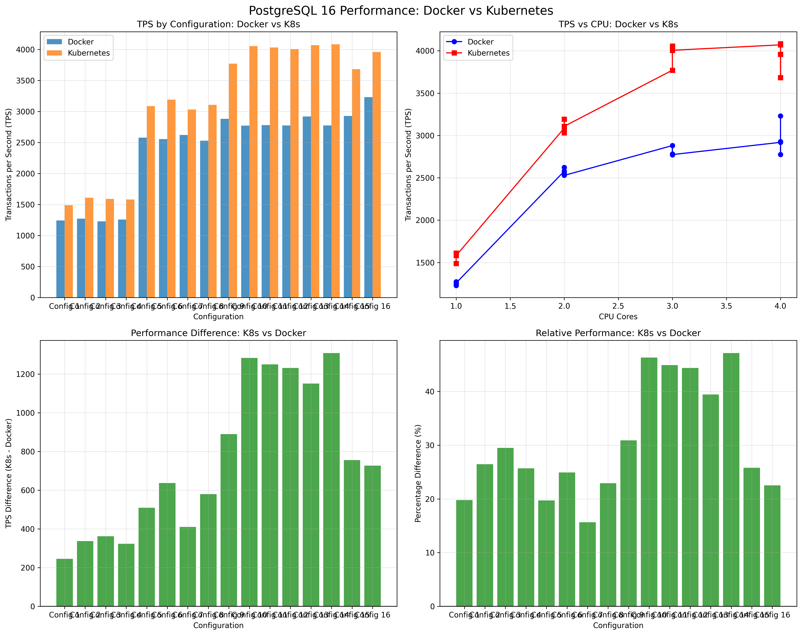

# PostgreSQL 16 Performance Analysis Report: Docker vs Kubernetes

**Generated on:** 2025-12-21 11:33:13

## System Environment

### Hardware & OS
- **Operating System**: Darwin 24.6.0
- **Architecture**: arm64

### Container Runtimes
- **Docker Version**: Docker version 29.1.3, build f52814d
- **Docker CPUs**: 8
- **Docker Memory**: 11.67GiB
- **Docker Runtime**: runc
- **Kubernetes Client**: Not available

### Kubernetes Cluster
```
docker-desktop   Ready    control-plane   18h   v1.34.1   192.168.65.3   <none>        Docker Desktop   6.12.54-linuxkit   docker://29.1.3

## Overview

This report compares PostgreSQL 16 performance between Docker containers and Kubernetes pods across different resource configurations.

## Configurations Tested

| Config | Docker CPU | Docker RAM | K8s CPU | K8s RAM |
|--------|------------|------------|---------|---------|
| 1 | 1.0 | 1g | 1.0 | 1g |
| 2 | 1.0 | 2g | 1.0 | 2g |
| 3 | 1.0 | 4g | 1.0 | 4g |
| 4 | 1.0 | 8g | 1.0 | 8g |
| 5 | 2.0 | 1g | 2.0 | 1g |
| 6 | 2.0 | 2g | 2.0 | 2g |
| 7 | 2.0 | 4g | 2.0 | 4g |
| 8 | 2.0 | 8g | 2.0 | 8g |
| 9 | 3.0 | 1g | 3.0 | 1g |
| 10 | 3.0 | 2g | 3.0 | 2g |
| 11 | 3.0 | 4g | 3.0 | 4g |
| 12 | 3.0 | 8g | 3.0 | 8g |
| 13 | 4.0 | 1g | 4.0 | 1g |
| 14 | 4.0 | 2g | 4.0 | 2g |
| 15 | 4.0 | 4g | 4.0 | 4g |
| 16 | 4.0 | 8g | 4.0 | 8g |

## Performance Analysis

### Key Findings

- **Config 1**: Docker TPS: 1242.74, K8s TPS: 1488.64, Difference: +245.89 TPS (+19.8%)
- **Config 2**: Docker TPS: 1273.55, K8s TPS: 1610.61, Difference: +337.07 TPS (+26.5%)
- **Config 3**: Docker TPS: 1228.23, K8s TPS: 1590.58, Difference: +362.35 TPS (+29.5%)
- **Config 4**: Docker TPS: 1258.05, K8s TPS: 1581.48, Difference: +323.43 TPS (+25.7%)
- **Config 5**: Docker TPS: 2578.49, K8s TPS: 3087.43, Difference: +508.94 TPS (+19.7%)
- **Config 6**: Docker TPS: 2554.49, K8s TPS: 3191.53, Difference: +637.03 TPS (+24.9%)
- **Config 7**: Docker TPS: 2621.92, K8s TPS: 3031.99, Difference: +410.07 TPS (+15.6%)
- **Config 8**: Docker TPS: 2528.67, K8s TPS: 3108.36, Difference: +579.69 TPS (+22.9%)
- **Config 9**: Docker TPS: 2880.60, K8s TPS: 3770.89, Difference: +890.28 TPS (+30.9%)
- **Config 10**: Docker TPS: 2771.15, K8s TPS: 4054.60, Difference: +1283.45 TPS (+46.3%)
- **Config 11**: Docker TPS: 2782.03, K8s TPS: 4031.90, Difference: +1249.87 TPS (+44.9%)
- **Config 12**: Docker TPS: 2774.16, K8s TPS: 4005.85, Difference: +1231.69 TPS (+44.4%)
- **Config 13**: Docker TPS: 2918.86, K8s TPS: 4069.85, Difference: +1150.98 TPS (+39.4%)
- **Config 14**: Docker TPS: 2774.74, K8s TPS: 4083.21, Difference: +1308.47 TPS (+47.2%)
- **Config 15**: Docker TPS: 2927.40, K8s TPS: 3683.10, Difference: +755.70 TPS (+25.8%)
- **Config 16**: Docker TPS: 3230.78, K8s TPS: 3958.13, Difference: +727.36 TPS (+22.5%)

## Performance Charts




## Raw Data

### Config 1 (1.0, 1g)

#### Docker

```
operation  time_seconds
      tps   1242.744547
```

#### Kubernetes

```
operation  time_seconds
      tps    1488.63509
```

### Config 2 (1.0, 2g)

#### Docker

```
operation  time_seconds
      tps   1273.547738
```

#### Kubernetes

```
operation  time_seconds
      tps   1610.614335
```

### Config 3 (1.0, 4g)

#### Docker

```
operation  time_seconds
      tps    1228.23325
```

#### Kubernetes

```
operation  time_seconds
      tps   1590.578937
```

### Config 4 (1.0, 8g)

#### Docker

```
operation  time_seconds
      tps   1258.050105
```

#### Kubernetes

```
operation  time_seconds
      tps   1581.480234
```

### Config 5 (2.0, 1g)

#### Docker

```
operation  time_seconds
      tps   2578.493201
```

#### Kubernetes

```
operation  time_seconds
      tps   3087.434604
```

### Config 6 (2.0, 2g)

#### Docker

```
operation  time_seconds
      tps   2554.493738
```

#### Kubernetes

```
operation  time_seconds
      tps   3191.527388
```

### Config 7 (2.0, 4g)

#### Docker

```
operation  time_seconds
      tps   2621.921995
```

#### Kubernetes

```
operation  time_seconds
      tps   3031.993596
```

### Config 8 (2.0, 8g)

#### Docker

```
operation  time_seconds
      tps   2528.670701
```

#### Kubernetes

```
operation  time_seconds
      tps   3108.363456
```

### Config 9 (3.0, 1g)

#### Docker

```
operation  time_seconds
      tps   2880.604973
```

#### Kubernetes

```
operation  time_seconds
      tps   3770.886943
```

### Config 10 (3.0, 2g)

#### Docker

```
operation  time_seconds
      tps    2771.15395
```

#### Kubernetes

```
operation  time_seconds
      tps   4054.602521
```

### Config 11 (3.0, 4g)

#### Docker

```
operation  time_seconds
      tps   2782.025777
```

#### Kubernetes

```
operation  time_seconds
      tps    4031.89877
```

### Config 12 (3.0, 8g)

#### Docker

```
operation  time_seconds
      tps    2774.16135
```

#### Kubernetes

```
operation  time_seconds
      tps   4005.851748
```

### Config 13 (4.0, 1g)

#### Docker

```
operation  time_seconds
      tps   2918.862624
```

#### Kubernetes

```
operation  time_seconds
      tps   4069.845053
```

### Config 14 (4.0, 2g)

#### Docker

```
operation  time_seconds
      tps   2774.738668
```

#### Kubernetes

```
operation  time_seconds
      tps   4083.209272
```

### Config 15 (4.0, 4g)

#### Docker

```
operation  time_seconds
      tps   2927.399611
```

#### Kubernetes

```
operation  time_seconds
      tps   3683.101525
```

### Config 16 (4.0, 8g)

#### Docker

```
operation  time_seconds
      tps   3230.776637
```

#### Kubernetes

```
operation  time_seconds
      tps   3958.132458
```

