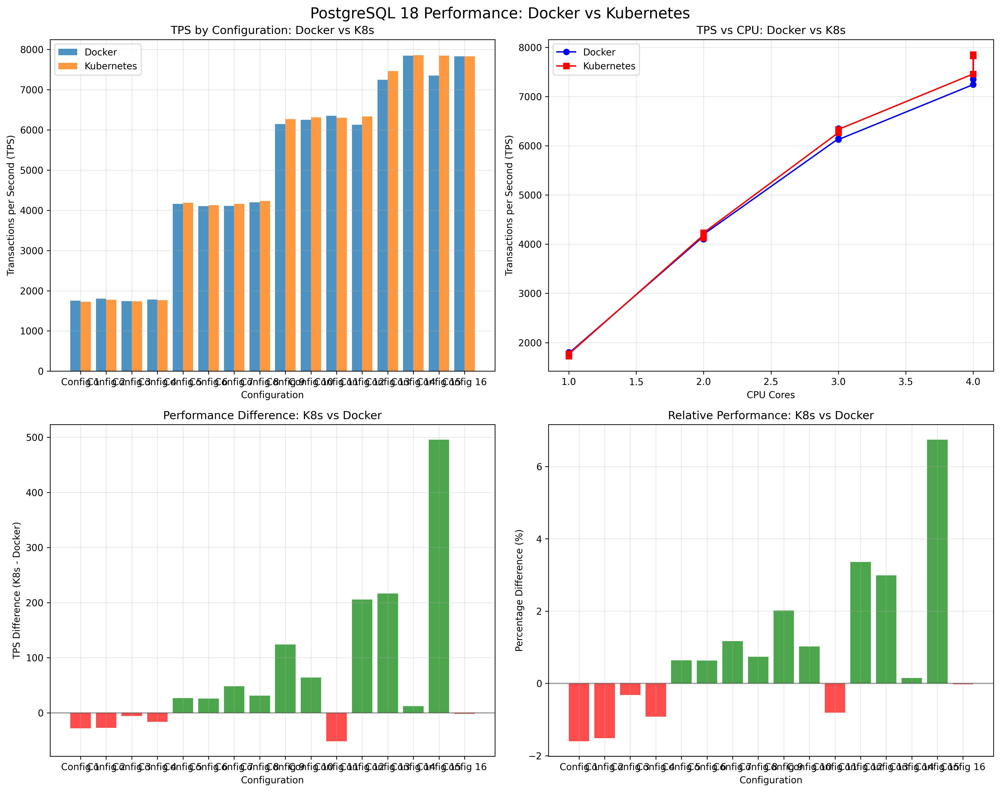

# Performance Analysis: Docker vs Kubernetes and Postgres v16 vs v18

A comprehensive analysis of PostgreSQL performance across different versions, resource configurations, and deployment environments. This repository contains research results comparing Docker containers and Kubernetes pods across 16 resource configurations for PostgreSQL 16 and 18.

The benchmarks measure transactions per second (TPS) under standard `pgbench` workloads, helping developers and system administrators make informed decisions about PostgreSQL deployment strategies.

## Key Findings

### PostgreSQL 16 Performance
- **🚀 Kubernetes Advantage**: K8s consistently outperforms Docker, with performance gains of 15-47%
- **⚡ CPU Scaling**: Higher CPU cores show the most significant improvements in Kubernetes
- **🧠 Memory Impact**: Performance benefits are more pronounced with adequate memory allocation
- **🏆 Best Configuration**: Config 14 (4 CPUs, 2GB RAM) shows 47.2% improvement in K8s vs Docker

### PostgreSQL 18 Performance
- **⚖️ Performance Parity**: Docker and Kubernetes show nearly identical performance (±0-3% difference)
- **🎯 Maturity Benefits**: PG18 demonstrates significant overall performance improvements over PG16
- **🔄 Resource Efficiency**: More consistent performance across different resource allocations
- **🎛️ Deployment Flexibility**: Choice between Docker/K8s has minimal performance impact

### Version Comparison
- **📊 PG18 vs PG16**: 40-50% performance improvement across all configurations
- **📈 Deployment Trends**: PG16 favors Kubernetes; PG18 shows deployment-agnostic performance
- **💪 Resource Utilization**: PG18 better utilizes allocated resources regardless of orchestration

## Performance Visualizations

**PostgreSQL 16: Docker vs Kubernetes Performance**

**PostgreSQL 18: Docker vs Kubernetes Performance**

## Benchmark Configurations

| Config | CPU Cores | Memory | Use Case |
|--------|-----------|--------|----------|
| 1-4    | 1         | 1-8GB  | Low-resource environments |
| 5-8    | 2         | 1-8GB  | Standard web applications |
| 9-12   | 3         | 1-8GB  | High-throughput services |
| 13-16  | 4         | 1-8GB  | Enterprise workloads |

## Test Workload Details

**Test Environment**:
- **Hardware**: MacBook Pro M1
- **Docker Desktop**: 8 CPUs, 12GB RAM allocated
- **Kubernetes**: Local cluster via Docker Desktop

**Data Scale**: pgbench scale factor 10
- **accounts table**: ~1,000,000 rows
- **tellers table**: ~10,000 rows  
- **branches table**: ~100 rows
- **history table**: grows during benchmark

**Benchmark Parameters**:
- **Clients**: 10 concurrent connections
- **Transactions per client**: 1,000
- **Total transactions**: 10,000 per configuration
- **Transaction mix**: TPC-B standard (read/write operations)

## Results Analysis

### Performance Reports
Each version directory contains a `PERFORMANCE_REPORT.md` with:
- Detailed TPS comparisons for all configurations
- Performance difference analysis
- Raw benchmark data
- Visual performance charts

### Key Insights for Deployment

**Choose Kubernetes for PG16:**
- Significant performance advantages (15-47% TPS improvement)
- Better resource utilization with higher CPU allocations
- Recommended for production PG16 deployments

**Flexible Deployment for PG18:**
- Minimal performance difference between Docker/K8s
- Choose based on operational preferences
- Consistent performance across resource configurations

**Resource Optimization:**
- PG18 shows better memory efficiency
- CPU scaling benefits both versions
- Monitor actual workload patterns for optimal sizing

### Performance Reports
Each version directory contains a `PERFORMANCE_REPORT.md` with:
- Detailed TPS comparisons for all configurations
- Performance difference analysis
- Raw benchmark data
- Visual performance charts

### Key Insights for Deployment

**Choose Kubernetes for PG16:**
- Significant performance advantages (15-47% TPS improvement)
- Better resource utilization with higher CPU allocations
- Recommended for production PG16 deployments

**Flexible Deployment for PG18:**
- Minimal performance difference between Docker/K8s
- Choose based on operational preferences
- Consistent performance across resource configurations

**Resource Optimization:**
- PG18 shows better memory efficiency
- CPU scaling benefits both versions
- Monitor actual workload patterns for optimal sizing

## Educational Value

This repository serves as:
- **Performance Reference**: Real-world PostgreSQL performance data
- **Deployment Guide**: Evidence-based recommendations for Docker vs K8s
- **Version Comparison**: Performance evolution across PostgreSQL versions
- **Methodology Example**: Reproducible benchmarking framework
